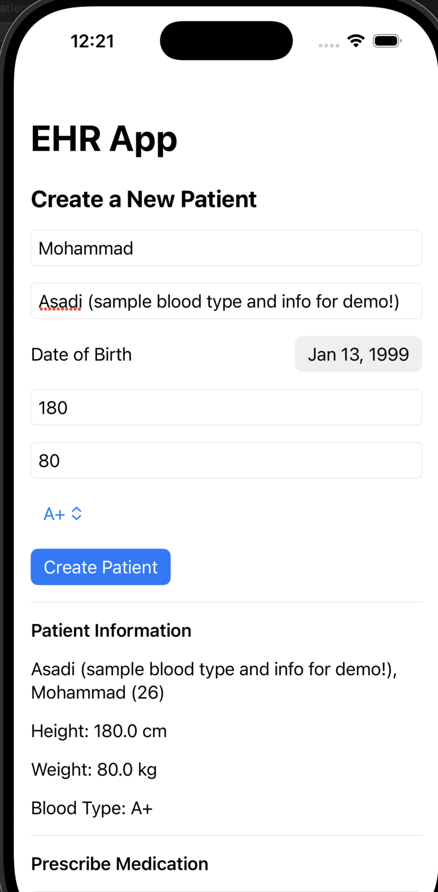
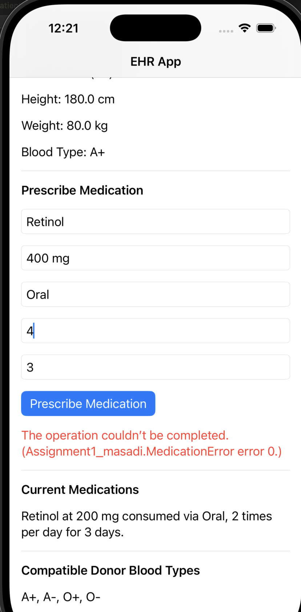

# Assignment1_masadiApp

A simple **Electronic Health Record (EHR)** application built using **Swift** and **SwiftUI** to explore the basics of iOS development. This app allows users to create and manage patient records, prescribe medications, and determine blood type compatibility.

### Screenshots

#### EHR Demo
This screenshot shows the main interface of the EHR application where you can create a new patient and view their details.



---

#### Prescribing Medication
This screenshot demonstrates the medication prescription functionality, including fields for medication details and error handling for duplicates.




---

## Features
1. **Patient Management**:
   - Add new patients with details like name, date of birth, height, weight, and optional blood type.
   - Auto-generate unique Medical Record Numbers (MRN) for each patient.

2. **Medication Management**:
   - View a list of current medications for each patient, sorted by date prescribed.
   - Prescribe new medications while avoiding duplicates for active medications.
   - Automatically determine if a medication is completed based on the prescription duration.

3. **Blood Type Compatibility**:
   - Determine which blood types a patient can receive blood from using the `BloodType` enum.

4. **CustomStringConvertible Support**:
   - Human-readable descriptions for medications and patients, making it easier to display them in the app.

5. **Unit Testing**:
   - Comprehensive unit tests are included for the `BloodType`, `Medication`, and `Patient` types to ensure robust functionality.

---

## Project Structure
```plaintext
Assignment1_masadiApp/
│
├── Assignment1_masadiApp/
│   ├── BloodType.swift       # Enum for blood types with compatibility logic
│   ├── Medication.swift      # Struct for medications with completion logic
│   ├── Patient.swift         # Class for managing patient data and methods
│   ├── ContentView.swift     # SwiftUI UI for creating and managing patients
│
├── Assignment1_masadiTests/
│   ├── BloodTypeTests.swift  # Unit tests for BloodType functionality
│   ├── MedicationTests.swift # Unit tests for Medication logic
│   ├── PatientTests.swift    # Unit tests for Patient logic and methods
│
└── README.md                 # Project description
```

### How It Works

#### **BloodType**
The `BloodType` enum represents all possible blood types and includes functionality to determine blood donation compatibility.

- **Blood Types**:
  - `A+`, `A-`, `B+`, `B-`, `AB+`, `AB-`, `O+`, and `O-`.
  
- **Methods**:
  - `canReceive(from:)`:
    - Determines if a blood type can receive a donation from another.
    - Example:
      ```swift
      let recipient = BloodType.Ap
      let donor = BloodType.On
      recipient.canReceive(from: donor) // true
      ```
  - `compatibleDonors()`:
    - Returns a list of compatible blood types for the current blood type.
    - Example:
      ```swift
      BloodType.Bp.compatibleDonors() // [Bp, Bn, Op, On]
      ```

---

#### **Medication**
The `Medication` struct represents a prescribed medication with properties for details such as the name, dose, route, and duration.

- **Properties**:
  - `datePrescribed`: The date the medication was prescribed.
  - `name`: The name of the medication.
  - `dose`: The dosage (e.g., "500mg").
  - `route`: The route of administration (e.g., "oral").
  - `frequency`: Number of times per day the medication is taken.
  - `duration`: The duration of the prescription in days.

- **Computed Properties**:
  - `isCompleted`:
    - Checks if the medication’s duration has elapsed and determines if it is completed.
    - Example:
      ```swift
      let medication = Medication(datePrescribed: Date(), name: "Ibuprofen", dose: "200mg", route: "oral", frequency: 2, duration: 5)
      medication.isCompleted // false if within 5 days, true otherwise
      ```
  - `description`:
    - Provides a human-readable description of the medication.
    - Example:
      ```swift
      print(medication.description)
      // Output: "Ibuprofen at 200mg consumed via oral, 2 times per day for 5 days."
      ```

---

#### **Patient**
The `Patient` class represents an individual patient and manages their data, medications, and functionalities.

- **Properties**:
  - `medicalRecordNumber`: A unique, auto-incrementing number for each patient.
  - `firstName` and `lastName`: The patient's name.
  - `dateOfBirth`: The patient's date of birth.
  - `height` and `weight`: The patient's physical attributes in cm and kg.
  - `bloodType`: Optional blood type that can be updated later.
  - `medications`: A list of all medications prescribed to the patient.

- **Methods**:
  - `calculateAge()` (private):
    - Calculates the patient’s age in years using their date of birth.
    - Example:
      ```swift
      let age = patient.calculateAge() // 30
      ```

  - `fullNameWithAge()`:
    - Returns the patient’s full name and age in the format: `Last name, First name (Age)`.
    - Example:
      ```swift
      patient.fullNameWithAge()
      // Output: "Doe, John (30)"
      ```

  - `currentMedications()`:
    - Filters the patient’s medications to return only active ones, sorted by the most recent `datePrescribed`.
    - Example:
      ```swift
      patient.currentMedications()
      // Output: [Medication, Medication]
      ```

  - `prescribeMedication(_:)`:
    - Adds a new medication to the patient’s list, but ensures no duplicates of active medications.
    - Throws an error if the medication is already active.
    - Example:
      ```swift
      try patient.prescribeMedication(newMedication)
      ```
    - Throws:
      - `MedicationError.duplicateMedication` if the medication is already prescribed and active.

  - `compatibleDonorBloodTypes()`:
    - Determines which blood types the patient can receive blood from based on their blood type.
    - Returns `nil` if the blood type is not known.
    - Example:
      ```swift
      patient.compatibleDonorBloodTypes()
      // Output: [.Ap, .An, .Op, .On]
      ```

---

#### **ContentView**
The `ContentView` is the SwiftUI interface for managing patients and medications.

- **Features**:
  - Input forms to add a new patient, including name, date of birth, height, weight, and blood type.
  - Displays the patient’s full name, age, height, weight, and blood type.
  - Prescribes new medications to the patient, ensuring no duplicates of active medications.
  - Lists active medications in order of the most recently prescribed.
  - Displays the patient’s compatible donor blood types for transfusion.

- **Interactions**:
  - Users can create a new patient, view their details, add medications, and see updated lists of active medications and compatible blood types in real-time.

---

